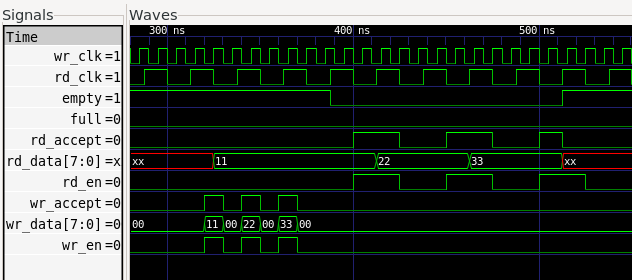
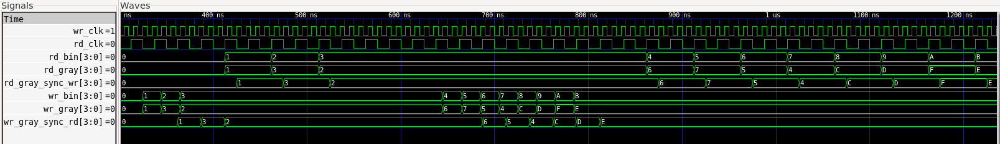
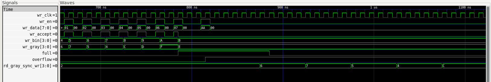
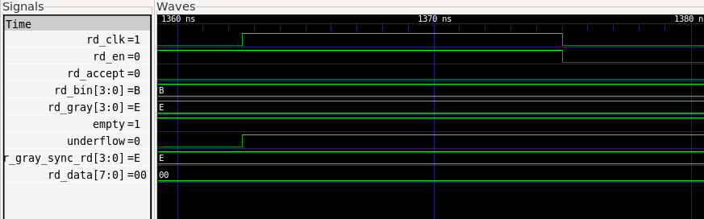

# CDC-Safe Asynchronous FIFO in SystemVerilog


## Overview

This project implements a parameterized asynchronous FIFO in SystemVerilog for safe data transfer between independent write and read clock domains.

The design uses:

- Local binary write/read pointers
- Gray-coded pointers for clock-domain crossing
- Two-flop synchronizers
- Full and empty flag generation using synchronized remote pointers
- Overflow and underflow detection

The goal of this project is not only to build a FIFO, but also to demonstrate CDC-aware RTL design and verification practice.

## Why This Project Matters

Asynchronous FIFOs are commonly used in digital systems when data must move between unrelated clock domains.

Typical use cases include:

- FPGA designs with multiple clock domains
- SoC peripheral interfaces
- Data buffering between independent producer and consumer blocks
- CDC-safe transfer of streaming data

This project focuses on the core CDC design problem: safely transferring pointer information across clock domains while preserving correct FIFO full and empty behavior.

## Repository Structure

```text
cdc-safe-async-fifo-sv/
  rtl/
    async_fifo.sv
    fifo_mem.sv
    sync_2ff.sv

  tb/
    tb_async_fifo.sv
    async_fifo_assertions.sv

  docs/
    spec.md

  reports/
    simulation_summary.log
    verilator_lint.log

  README.md
```

## RTL Modules

| Module | Description |
|---|---|
| `async_fifo.sv` | Top-level asynchronous FIFO |
| `fifo_mem.sv` | Simple dual-port FIFO memory model |
| `sync_2ff.sv` | Two-flop synchronizer for Gray pointer crossing |

## Key Design Choices

### Binary Pointers Locally

Binary pointers are used locally in their own clock domains.

```text
wr_bin: write clock domain
rd_bin: read clock domain
```

Binary pointers are convenient for incrementing and addressing memory.

### Gray Pointers for CDC

Gray-coded pointers are transferred across clock domains.

```text
wr_gray -> read clock domain
rd_gray -> write clock domain
```

Gray code is used because only one bit changes between consecutive values, reducing the risk of sampling an invalid multi-bit transition.

### Two-Flop Synchronizers

Each Gray-coded pointer is passed through a two-flop synchronizer before being used in the opposite clock domain.

```text
wr_gray -> sync_2ff -> wr_gray_sync_rd
rd_gray -> sync_2ff -> rd_gray_sync_wr
```

This reduces metastability risk, although RTL simulation cannot fully model metastability.

### Extra Pointer Bit

The write and read pointers use one extra bit beyond the memory address width.

For example:

```text
DEPTH = 8
ADDR_WIDTH = 3
Pointer width = 4 bits
```

The extra bit helps distinguish full and empty after pointer wrap-around.

### Full Detection

Full detection is performed in the write clock domain.

The FIFO is full when the next write Gray pointer equals the synchronized read Gray pointer with its top two bits inverted.

### Empty Detection

Empty detection is performed in the read clock domain.

The FIFO is empty when the next read Gray pointer equals the synchronized write Gray pointer.

## Verification

The design is verified using a SystemVerilog testbench with independent write and read clocks.

The write clock and read clock run at different periods to exercise asynchronous behavior.

## Test Coverage

| Test | Description | Result |
|---|---|---|
| Reset behavior | Checks reset values of `full`, `empty`, `overflow`, and `underflow` | Pass |
| Basic write/read | Writes `0x11`, `0x22`, `0x33` and reads them back in order | Pass |
| Empty flag | Checks that FIFO becomes empty after all data is read | Pass |
| Full flag | Writes `DEPTH` entries and checks `full` | Pass |
| Overflow | Attempts write while full and checks `overflow` | Pass |
| Drain FIFO | Reads all stored entries from the FIFO | Pass |
| Underflow | Attempts read while empty and checks `underflow` | Pass |

## Simulation Result

Simulation was run using Icarus Verilog.

Output is saved in:

```text
reports/simulation_summary.log
```

Example output:

```text
Starting async FIFO sanity test...
Reset test passed.
READ PASS: data=0x11
READ PASS: data=0x22
READ PASS: data=0x33
Basic write/read test completed.
Empty flag test passed.
Full flag test passed.
Overflow test passed.
Drain test passed.
Underflow test passed.
All sanity tests completed.
```

## Waveform Inspection

Waveform inspection was performed using GTKWave.

Important signals to inspect:

```text
wr_clk
rd_clk
wr_rst_n
rd_rst_n

wr_en
wr_data
wr_accept
wr_bin
wr_gray
full
overflow

rd_en
rd_data
rd_accept
rd_bin
rd_gray
empty
underflow

rd_gray_sync_wr
wr_gray_sync_rd
```

Key observations:

- `wr_bin` increments on accepted writes.
- `wr_gray` follows the Gray-coded version of `wr_bin`.
- `wr_gray_sync_rd` updates after synchronization delay in the read clock domain.
- `full` asserts after the FIFO reaches capacity.
- `overflow` asserts when writing while full.
- `empty` asserts after all data is drained.
- `underflow` asserts when reading while empty.

## Waveform Examples

### Basic Write/Read

The waveform below shows that data written into the FIFO is read back in the same order.  
This confirms correct FIFO ordering behavior.



### Gray Pointer Synchronization

The waveform below shows local binary and Gray-coded pointers together with their synchronized versions in the opposite clock domains.  
This demonstrates the CDC behavior of the design.



### Full and Overflow Behavior

The waveform below shows the FIFO reaching the full condition.  
A write attempt while `full=1` is rejected (`wr_accept=0`) and `overflow` is asserted.



### Empty and Underflow Behavior

The waveform below shows the FIFO in the empty condition.  
A read attempt while `empty=1` is rejected (`rd_accept=0`) and `underflow` is asserted.




## Lint

Lint was run using Verilator.

Command:

```bash
verilator --lint-only -Wall \
  rtl/sync_2ff.sv \
  rtl/fifo_mem.sv \
  rtl/async_fifo.sv
```

Lint output is saved in:

```text
reports/verilator_lint.log
```

## Tool Flow

| Tool | Purpose |
|---|---|
| Icarus Verilog | RTL simulation |
| GTKWave | Waveform inspection |
| Verilator | Lint checking |
| WSL Ubuntu | Linux-based development environment |
| VS Code | Code editing |

## How to Run

## Quick Start

Run simulation:

```bash
make sim
```

Run lint:

```bash
make lint
```

Generate reports:

```bash
make reports
```

Open waveform:

```bash
make waves
```

Clean generated files:

```bash
make clean
```


## SystemVerilog Assertions

The testbench includes additional assertion checks in:

```text
tb/async_fifo_assertions.sv
```

These assertions are used only for simulation and verification. They are not part of the synthesizable FIFO RTL.

The assertion checks cover the following FIFO safety properties:

| Assertion | Purpose |
|---|---|
| Gray pointer one-bit transition | Ensures Gray-coded pointers change by at most one bit per local clock cycle |
| No write while full | Ensures the write pointer does not advance when the FIFO is full |
| No read while empty | Ensures the read pointer does not advance when the FIFO is empty |
| Write pointer increment | Ensures accepted writes increment the write pointer by one |
| Read pointer increment | Ensures accepted reads increment the read pointer by one |
| Pointer stability | Ensures pointers remain stable when no operation is accepted |

These checks improve confidence in the FIFO control logic during reset, normal operation, full condition, empty condition, overflow, and underflow scenarios.


## Current Status

| Item | Status |
|---|---|
| RTL compile | Passing |
| Sanity simulation | Passing |
| Waveform generation | Passing |
| Waveform inspection | Completed |
| Verilator lint | Passing |

## Known Limitations

- RTL simulation does not fully model metastability.
- Static CDC signoff is not included.
- The FIFO memory model currently uses asynchronous read behavior.
- Almost-full and almost-empty thresholds are fixed.
- Formal verification is not included yet.

## Future Work

- Add cocotb randomized tests with a Python reference model.
- Add programmable almost-full and almost-empty thresholds.
- Add a synchronous-read memory variant for FPGA block RAM inference.
- Add formal verification for FIFO safety properties.